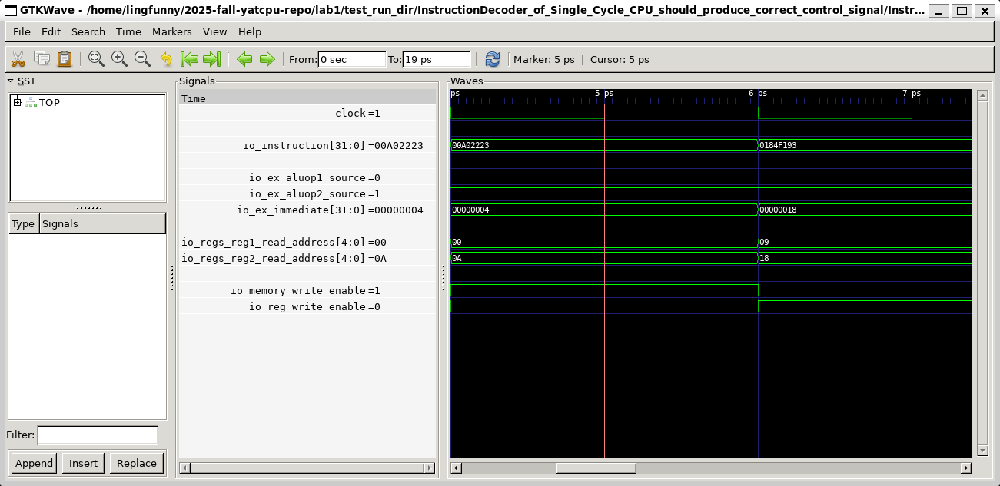
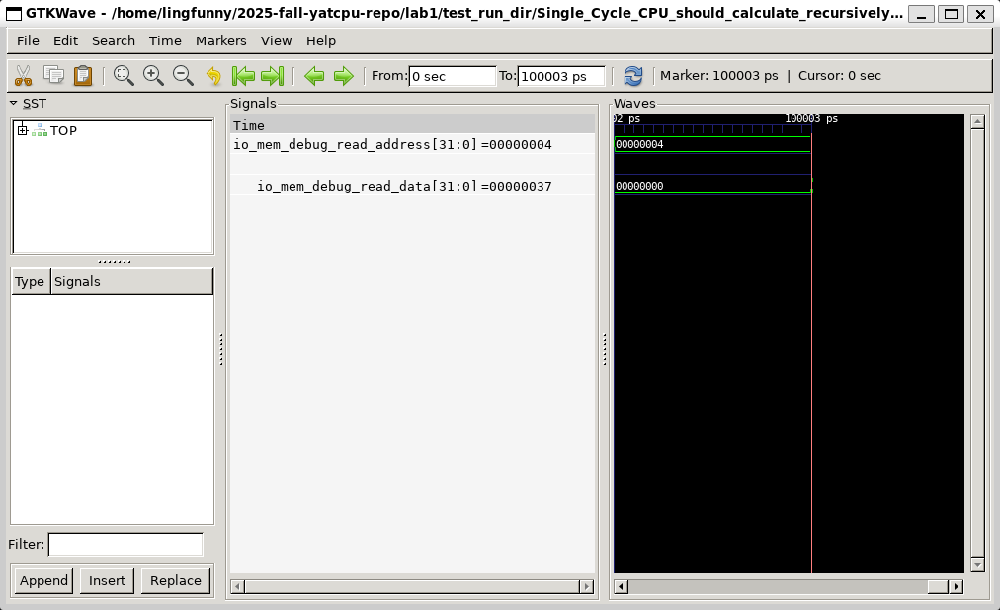

# lab1 实验报告

姓名：廖海涛
学号：24344064

## InstructionDecoderTest

考虑 InstructionDecoderTest.scala 文件中对 Store 类型指令的测试。

测试文件通过 `poke` 向程序传入指令，用 `expect` 方法检测模块的输出是否符合预期。例如下面对于 Store 类型指令的测试代码片段：

```scala
// InstructionTypes.S 
c.io.instruction.poke(0x00a02223L.U) // sw x10, 4(x0)
c.io.ex_aluop1_source.expect(ALUOp1Source.Register) // sw 指令，第一个操作数应来自寄存器
c.io.ex_aluop2_source.expect(ALUOp2Source.Immediate) // sw 指令，第二个操作数应是立即数
c.io.ex_immediate.expect(4.U) // 期望立即数为 4
c.io.regs_reg1_read_address.expect(0.U) // 基址寄存器为 x0 = 0
c.io.regs_reg2_read_address.expect(10.U) // 源寄存器为 x10
c.io.memory_write_enable.expect(true.B) // sw 指令，内存写使能应为 true
c.io.reg_write_enable.expect(false.B) // sw 指令不写回寄存器
c.clock.step()
```

下面观察波形图。首先需要明确不同信号的含义：

```scala
object ALUOp1Source {
  val Register = 0.U(1.W)
  val InstructionAddress = 1.U(1.W)
}

object ALUOp2Source {
  val Register = 0.U(1.W)
  val Immediate = 1.U(1.W)
}
```



可以看到波形图中各个信号与 expect 相吻合。

## CPUTest Fibonacci

检查 `csrc` 下 `fibnacci.c` 的内容如下：

```c
int fib(int a) {
  if (a == 1 || a == 2) return 1;
  return fib(a - 1) + fib(a - 2);
}

int main() {
  *(int *)(4) = fib(10);
}
```

该程序通过递归计算 Fibonacci 数列的第 10 项（值为 55），并将结果写入内存地址 4 处。在 CPUTest.scala 中，测试代码片段如下：

```scala
test(new TestTopModule("fibonacci.asmbin")).withAnnotations(TestAnnotations.annos) { c =>
    for (i <- 1 to 50) {
    c.clock.step(1000)
    c.io.mem_debug_read_address.poke((i * 4).U) // Avoid timeout
    }

    c.io.mem_debug_read_address.poke(4.U)
    c.clock.step()
    c.io.mem_debug_read_data.expect(55.U)
}
```

Chisel 测试先让程序运行 50000 个周期确保程序运行完得到了结果，再通过 `poke` 向 CPU 模块传入内存地址 4，并通过 `expect` 检测该地址处的值是否为 55。

下面查看波形图，可以看到在最后一个周期，`mem_debug_read_data` 信号的值为 0x37=55，符合预期。

