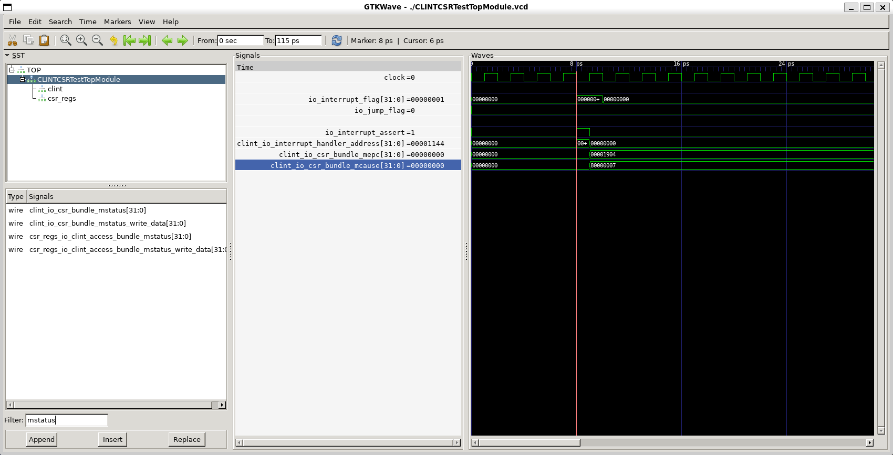
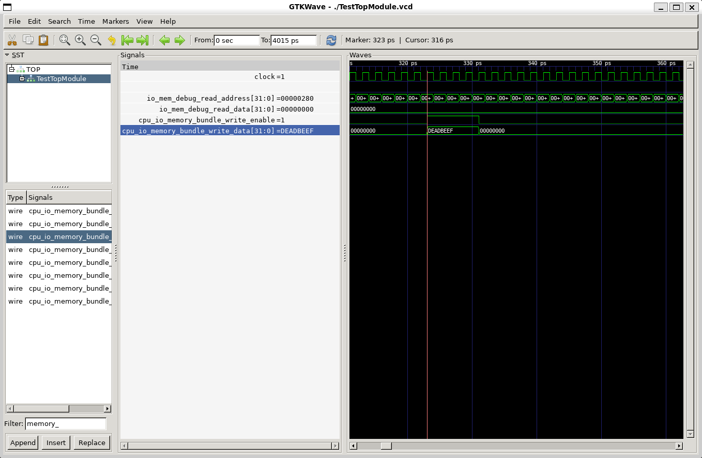
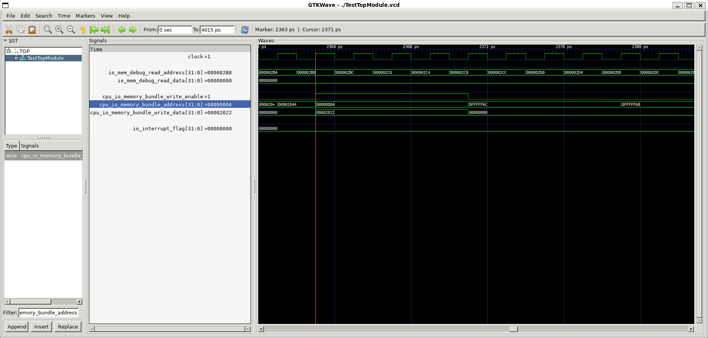
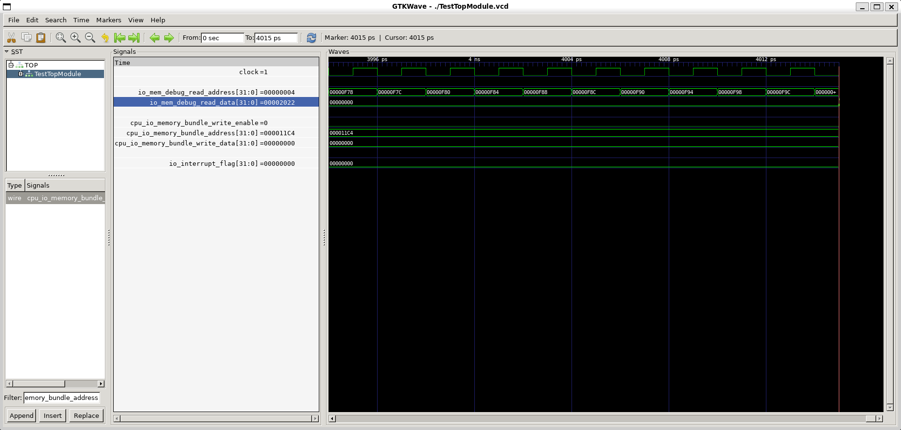

# lab2 实验报告

姓名：廖海涛
学号：24344064

## CLINTCSRTest 硬件终端中断测试（handle external interrupt）

### 测试程序原理

这一测试中，有若干个输入信号，作用如下：

- `jump_flag / jump_address`: 模拟当前指令是否为跳转指令，用于测试 `mepc` 的正确性（是保存 PC+4 还是跳转目标）。
- `interrupt_flag`: 模拟外部中断信号（如 `InterruptCode.Timer0`）。
- `csr_regs_write_*`: 用于预先初始化 `mtvec`（中断处理程序入口）和 `mstatus`（开启中断）。
- `instruction` / `instruction_address`: 模拟当前 CPU 执行到的指令及其地址。

可对照第一个测试的代码：

```scala
// ...
c.io.jump_flag.poke(false.B)
c.io.instruction_address.poke(0x1900L.U)
c.io.instruction.poke(InstructionsNop.nop)
c.io.interrupt_flag.poke(InterruptCode.Timer0)

c.io.interrupt_assert.expect(true.B)
c.io.interrupt_handler_address.expect(0x1144L.U)
c.clock.step()
c.io.interrupt_flag.poke(InterruptCode.None)
c.io.csr_regs_debug_read_address.poke(CSRRegister.MEPC)
c.io.csr_regs_debug_read_data.expect(0x1904L.U)
c.io.csr_regs_debug_read_address.poke(CSRRegister.MCAUSE)
c.io.csr_regs_debug_read_data.expect(0x80000007L.U)
c.io.csr_regs_debug_read_address.poke(CSRRegister.MSTATUS)
c.io.csr_regs_debug_read_data.expect(0x1880L.U)
// ...
c.io.instruction.poke(InstructionsRet.mret)
c.io.interrupt_assert.expect(true.B)
c.io.interrupt_handler_address.expect(0x1904L.U)
c.clock.step()
c.io.csr_regs_debug_read_address.poke(CSRRegister.MSTATUS)
c.io.csr_regs_debug_read_data.expect(0x1888L.U)
```

该测试主要验证了：
1.  当 `mstatus.MIE=1` 且 `interrupt_flag` 有效时，CLINT 是否正确将 `interrupt_assert` 设为 `True` 并给出正确的跳转地址。
2.  验证 `mepc` 是否正确保存了返回地址，`mcause` 是否记录了正确的中断原因，`mstatus` 是否正确关闭了 MIE。
3.  验证 `mret` 指令是否能恢复现场。

### 波形图

在波形图中，一次完整的中断处理过程如下：

1.  **中断触发时刻**：
    -   `io_interrupt_flag` 变为 `1` (Timer0)。
    -   **关键信号**：`io_interrupt_assert` 变为 `1`，表示中断发生。`io_interrupt_handler_address` 变为 `0x1144` (预设的 mtvec)。
    -   **CSR 更新**：此时查看 CSR 寄存器，`mepc` 更新为 `0x1904` (当前指令地址 0x1900 + 4)，`mcause` 更新为 `0x80000007` (最高位1 + Timer编号7)，`mstatus` 的 MIE 位变 0。

2.  **中断返回时刻**：
    -   `io_instruction` 变为 `0x30200073` (`mret` 指令)。
    -   **关键信号**：`io_interrupt_assert` 再次变为 `1` (CLINT以此信号通知 IF 阶段跳转)。`io_interrupt_handler_address` 变为 `0x1904` (即之前保存的 mepc)。
    -   **状态恢复**：`mstatus` 的 MIE 位恢复为 1 (从 MPIE 恢复)。




## SimpleTrapTest 测试

### 测试程序原理

`simpletest.c` 通过以下逻辑验证中断处理：
1.  主程序将 Timer 的 `limit` 寄存器（地址 `0x4`）设置为一个初始值 `0xDEADBEEF`。
2.  调用 `enable_interrupt()` 开启 CPU 全局中断。
3.  进入死循环 `for(;;)` 等待。
4.  依据 CPUTest.scala，经过 1000 个周期后，CPU poke 一个中断信号。
5.  `trap_handler` 将 `limit` 寄存器（地址 `0x4`）的值修改为 `0x2022`。
6.  测试框架检测内存地址 `0x4` 的值是否最终变成了 `0x2022`。如果变了，说明中断成功触发并正确执行了处理函数。

### 波形图

在波形图中，说明程序成功执行的关键信号如下：
-   **写操作**：关注 `io_memory_bundle_write_enable` 为高电平，`io_memory_bundle_address` 为 `0x4`。
-   **数据变化**：
    -   第一次写 `io_memory_bundle_write_data` 为 `0xDEADBEEF` (主程序初始化)。
    -   之后进入等待状态，经过约 1000 个周期， CPU 收到中断信号。
    -   执行程序一段时间后，出现写操作，`io_memory_bundle_write_data` 变为 **`0x2022`**。这证明代码执行流成功进入了 `trap_handler` 并执行了赋值语句。
    -   最终测试框架检测到内存地址 `0x4` 的值为 `0x2022`，测试通过。








## 操作系统与 Timer 中断协作过程

假如 CPU 运行操作系统，Timer 中断的处理流程如下：

1.  **初始化阶段 (OS)**：
    -   OS 启动时，将中断处理程序（Trap Handler）的入口地址写入 `mtvec` 寄存器。
    -   OS 设置 Timer 的比较值（`limit`），并置位 `mstatus.MIE` 开启中断。

2.  **中断触发 (Hardware)**：
    -   当 Timer 的计数器 `count` >= `limit` 时，Timer 模块拉高中断信号。

3.  **硬件响应 (CPU)**：
    -   CPU 暂停当前用户程序的执行。
    -   将当前 PC 保存到 `mepc`，将中断原因（Timer Interrupt）保存到 `mcause`，将当前中断使能状态 `mstatus.MIE` 保存到 `mstatus.MPIE`。
    -   将 `mstatus.MIE` 置 0，防止中断嵌套。
    -   PC 跳转到 `mtvec` 指向的 OS 中断处理程序地址。

4.  **软件处理 (OS)**：
    -   OS 首先将通用寄存器（x1-x31）保存到内核栈中。
    -   读取 `mcause` 发现是定时器中断。
    -   OS 利用这个时机进行进程调度，决定切换到下一个进程。
    -   OS 写入新的值到 Timer 的 `limit` 寄存器，清除当前中断信号并设定下一次中断时间。
    -   OS 恢复通用寄存器。
    -   执行 `mret` 指令。

5.  **硬件返回 (CPU)**：
    -   CPU 从 `mepc` 恢复 PC。
    -   从 `mstatus.MPIE` 恢复 `mstatus.MIE`（重新开启中断）。
    -   继续执行用户程序。